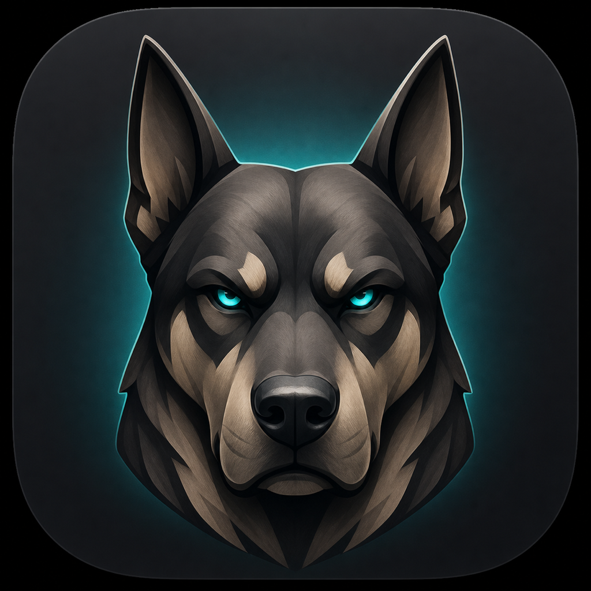

# ChatGPT Goal Watchdog



A small macOS menu bar app that watches the currently displayed conversation in the ChatGPT desktop app. When Goal mode exposes a **Resume goal** button, the watchdog clicks it and restores the previous app and pointer position.

> Private pre-release. The public release and contribution rules are not finalized yet.

## What it does

- Watches only the current ChatGPT main window.
- Resolves the resume button and its position dynamically through macOS Accessibility.
- Supports `恢復目標`, `恢复目标`, and `Resume goal`.
- Does not read goal text, capture the screen, or use the network.
- Runs as a menu bar app without a Dock icon.

## Build

Requirements: macOS 14 or later and the Xcode command line tools.

```sh
./scripts/build.sh
open "dist/ChatGPT Goal Watchdog.app"
```

The development build is ad-hoc signed. macOS may require Accessibility authorization again after rebuilding because an ad-hoc signature does not provide a stable identity across versions.

## Permissions

The app needs:

- **Accessibility** to inspect the ChatGPT window and send the mouse click.
- **Automation → ChatGPT** to bring ChatGPT to the foreground before clicking.

No credentials or ChatGPT data are stored.

## Release status

Official GitHub binaries will require a stable bundle identifier, Developer ID signing, Hardened Runtime, and Apple notarization. Automatic updates and the open-source license will be decided before the repository becomes public.

